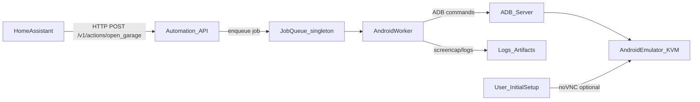

# Self-hostable Chirp automation container (Android emulator + REST)

## Goals

- Keep an **always-on, hot emulator** with Chirp installed and logged in.
- Expose a **simple REST webhook** for Home Assistant to trigger actions like **open_garage** quickly.
- Be **extensible**: others can add their own “devices/actions” without editing code.

## Non-goals

- No official Chirp API discovery or reverse engineering.
- No brittle “screen coordinate only” approach as the only option (prefer selector-based steps).

## Architecture

- **Single container** (simplest deploy): runs emulator + ADB + API server.
- **Persistent volumes**: emulator userdata/AVD so Chirp stays logged in.
- **Single-flight execution**: one job at a time to avoid UI contention.

## Runtime choice (why this approach)

- You can’t run an `.apk` “standalone” without an Android runtime; even “lightweight” solutions like Waydroid/Anbox still provide an Android environment.
- With your host supporting KVM (`/dev/kvm`), an **x86_64 emulator** is typically the fastest + simplest “always-on” option.

## Container design

### Base image strategy

- **Use a battle-tested emulator image** (recommended): base from something like `budtmo/docker-android` (includes emulator, ADB, and optional noVNC).
- Pros: fastest path to a stable “emulator-in-docker” + web UI.
- Cons: larger image.

### Processes inside container

- **Emulator supervisor**: starts emulator with KVM acceleration and stable flags.
- **ADB server**: `adb start-server` and waits for `emulator-5554`.
- **Automation API**: Node/TypeScript service exposing webhook endpoints.

### Host prerequisites

Document in README (and validate at startup):

- Linux x86_64 with virtualization enabled
- KVM modules loaded and `/dev/kvm` present
- Install host packages (example): `qemu-kvm` and related deps
- Docker run/compose must pass KVM through:
- `--device /dev/kvm` and typically `--privileged` (or the minimum required caps)

## Automation approach (robust + extensible)

### Action model

Actions are defined as a sequence of steps in a user-editable file:

- [`config/actions.yaml`](config/actions.yaml)

Each action is a list of steps like:

- `ensure_emulator_ready`
- `wake_and_unlock`
- `launch_app`
- `assert_logged_in` (best-effort: detect “Sign in” and fail with guidance)
- `tap_selector` (preferred): match element by text/resource-id/content-desc via UIAutomator dump
- `tap_coordinates` (fallback)
- `wait_for_text` / `wait_for_selector`
- `retry` wrapper with timeout

### Implementation details (worker)

- Use ADB-driven primitives:
- app control: `adb shell am start -n ...`
- keyevents: `adb shell input keyevent ...`
- taps: `adb shell input tap x y`
- screenshots for debugging: `adb exec-out screencap -p`
- For selector-based clicks:
- run `adb shell uiautomator dump` and pull the XML
- parse XML and find bounds for matching nodes
- tap center of bounds

This avoids needing Appium (heavier) while still supporting non-coordinate automation.

### Keeping it “hot and ready”

- Persist emulator userdata in a Docker volume.
- Disable sleep / keep screen on (best effort).
- Watchdog loop:
- if emulator not responding: restart emulator
- if Chirp not in foreground: relaunch

## REST API (Home Assistant-friendly)

Endpoints (token-protected):

- `POST /v1/actions/:actionId` → triggers an action (e.g. `open_garage`)
- `GET /v1/health` → readiness (emulator booted, adb connected)
- `GET /v1/debug/screenshot` → PNG screenshot (auth required)
- `GET /v1/debug/state` → current foreground app, last action result

Behavior:

- Serialize execution (one job at a time).
- Default timeout per action (e.g. 15–30s) with clear error reasons.

## First-run setup flow (manual once)

1. Start container (emulator boots, AVD created/loaded).
2. Use **optional noVNC** (or `adb` + screenshot loop) to:

- install Chirp (Play Store or sideload APK)
- open Chirp
- login

3. Confirm persisted session:

- restart container
- verify Chirp opens without re-login

4. Configure actions in `config/actions.yaml`.

## Home Assistant integration

- Add a REST command or webhook automation:
- `POST http://<host>:<port>/v1/actions/open_garage`
- include `Authorization: Bearer <token>`
- Optional: return JSON with `{status, durationMs, error}` and have HA notify on failures.

## Extensibility

- Users add actions by editing `config/actions.yaml` only.
- Provide a “recipe” system:
- `recipes/chirp-default.yaml` with common steps
- allow users to override app package/activity if Chirp variants differ
- Provide a small “calibration” helper:
- endpoint to dump UI tree + screenshot to help create selectors

## Observability + safety

- Structured logs (action start/end, step timings).
- Save last N screenshots on failure to a volume: `./data/artifacts`.
- Rate limiting / replay protection optional (simple in-memory cooldown for garage).

## Security

- Require bearer token.
- Recommend running on LAN only (no port exposed to internet) or behind reverse proxy with auth.
- Never log secrets.

## Proposed repo structure

- [`docker/Dockerfile`](docker/Dockerfile)
- [`docker/entrypoint.sh`](docker/entrypoint.sh)
- [`docker-compose.yml`](docker-compose.yml)
- [`src/server.ts`](src/server.ts)
- [`src/worker/runner.ts`](src/worker/runner.ts)
- [`src/worker/adb.ts`](src/worker/adb.ts)
- [`src/worker/uiautomator.ts`](src/worker/uiautomator.ts)
- [`config/actions.yaml`](config/actions.yaml)
- [`README.md`](README.md)

## Known risks / constraints (document up front)

- If Chirp is **ARM-only** or depends on device integrity checks, it may not run on an x86 emulator.
- UI changes in Chirp can break selectors; provide debug tooling to update actions quickly.

## Implementation todos

- **infra-docker**: Create Dockerfile/compose that boots emulator with KVM, exposes API port, persists AVD/userdata volumes.
- **api-webhook**: Implement TypeScript REST API (`/v1/actions/:id`, `/v1/health`) with token auth.
- **action-config**: Define `config/actions.yaml` schema and loader/validator.
- **adb-worker**: Implement job queue + ADB primitives + retry/timeouts.