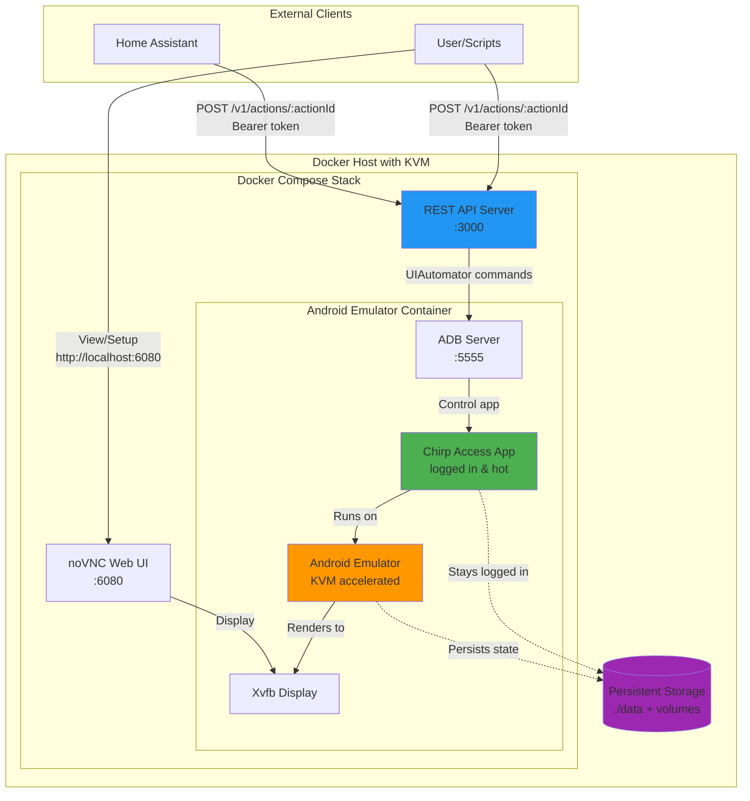

# Chirp Access App Automation

Self-hosted Android emulator + REST API for automating the Chirp Access app. The emulator stays hot and logged in; Home Assistant can trigger actions via HTTP.

> [!IMPORTANT]  
> This is a small side project to save me 10 seconds when arriving at my apartment, because of that most of this code was created by AI and not thoroughly reviewed by me. Use at your own risk.

## Architecture



## Prerequisites

- Linux x86_64 host with virtualization enabled in BIOS/UEFI
- KVM kernel modules loaded and `/dev/kvm` available
- Docker (and docker-compose plugin)

If you are deploying onto a VM or a “server inside a container”, you must have **nested virtualization** enabled and ensure `/dev/kvm` is passed through to the container. If `/dev/kvm` is not present inside the container, the emulator will not start.

Example host packages:

```
sudo apt-get install -y qemu-kvm
```

## Quick start

1. Set an API token:

```
export API_TOKEN="replace-me"
```

2. Build and start:

```
docker compose up --build
```

3. Confirm the API is up:

```
curl -H "Authorization: Bearer $API_TOKEN" http://localhost:${CHIRP_HTTP_PORT:-3000}/v1/health
```

4. Confirm the emulator is booted (readiness):

```
curl -H "Authorization: Bearer $API_TOKEN" http://localhost:${CHIRP_HTTP_PORT:-3000}/v1/ready
```

## Coolify Setup

1. Create a new resource in Coolify:
   - **Name**: chirp-automation
   - **Build Pack**: Docker Compose
   - **Docker Compose Location**: `/docker-compose.yaml` (default, no modification needed)

2. Configure **Domains**:
   - `https://chirp-automation.mycoolify.io:3000,https://vnc-chirp-automation.mycoolify.io:6080`
   - REMOVE THESE AND RESTART THE CONTAINER AFTER SETTING UP THE DEVICE (otherwise your device will be open to the internet)
   - **Note**: Use `http://` instead of `https://` if using [Cloudflare Tunnels](https://coolify.io/docs/knowledge-base/cloudflare/tunnels/full-tls#_7-update-urls-from-http-to-https)

3. Set **Environment Variables**:
   - `SKIP_EMULATOR_START=false`
   - `API_TOKEN=replace-me` (change to a secure token)
   - `SERVICE_FQDN_CHIRP_AUTOMATION=chirp-automation.mycoolify.io`
   - `SERVICE_URL_CHIRP_AUTOMATION=https://chirp.mycoolify.io` (use `http://` if using Cloudflare Tunnels)

4. Enable **Consistent Container Names** in the Advanced settings.

5. The remaining environment variables will be set automatically, and persistent data will be configured by the compose file.

## First-run setup (manual)

1. Open the noVNC UI at `http://localhost:${CHIRP_VNC_PORT:-6080}`.
2. Install Chirp:
   - **Note**: Google Play Store is not supported on Docker Android environments
   - Recommended: Install [Aurora Store](https://auroraoss.com/aurora-store) APK and install apps from there
   - Most apps on APK Mirror sites are .xapk files that are not easy to get working, just use the Aurora Store to install them.
3. Log in once; emulator + ADB state is persisted to `./data` and the `android-home` volume (`/home/androidusr`).
4. Restart the container to confirm Chirp stays logged in.

## macOS dev (external emulator)

macOS cannot use KVM, so run the Android emulator on the host (Android Studio) and connect the container via ADB over TCP.

```
export ADB_CONNECT="host.docker.internal:5555"
export SKIP_EMULATOR_START="true"
docker compose up --build
```

If your emulator listens on a different port, update both values accordingly.

## Actions configuration

Edit `config/actions.yaml` to add or update actions. Each action is a list of steps (tap selectors preferred, coordinates as fallback).

Supported step types:

- `ensure_emulator_ready`
- `wake_and_unlock`
- `launch_app`
- `ensure_app_open` (supports `delayMsIfOpen`, `delayMsIfLaunch`, and `alreadyOpenSelector`)
- `tap_selector`
- `tap_coordinates`
- `wait_for_text`
- `wait_for_selector`
- `wait_for_any_selector`
- `sleep`
- `input_text`
- `keyevent`
- `retry`
- `repeat`

Selectors match against UIAutomator fields: `text`, `resourceId`, `contentDesc`, and their `*Contains` variants.

## REST API

All endpoints require `Authorization: Bearer <token>`.

- `POST /v1/actions/:actionId`
- `GET /v1/health` (API up + emulator status)
- `GET /v1/ready` (503 until emulator booted)
- `GET /v1/debug/screenshot`
- `GET /v1/debug/state`

Example:

```
curl -X POST \
  -H "Authorization: Bearer $API_TOKEN" \
  http://localhost:${CHIRP_HTTP_PORT:-3000}/v1/actions/open_garage
```

## Local trigger command

```
API_TOKEN="replace-me" ./scripts/trigger-action.sh tap_parking_garage_gate
```

## Home Assistant example

```
rest_command:
  chirp_open_garage:
    url: "http://<host>:${CHIRP_HTTP_PORT:-3000}/v1/actions/open_garage"
    method: POST
    headers:
      Authorization: "Bearer <token>"
```

## Troubleshooting

- `RuntimeError: /dev/kvm cannot be found!`: the container cannot see KVM. Verify the host has `/dev/kvm`, and run with `--device /dev/kvm` (and typically `--privileged`). If you are inside another VM/container, enable nested virtualization and pass `/dev/kvm` through each layer.
- `Openbox-Message: Failed to open the display...`: the container could not connect to Xvfb. This project sets `DISPLAY=:0` automatically; if you override `DISPLAY`, make sure it matches the running X display.
- `API_TOKEN is required to start the server`: set `API_TOKEN` in your environment (or via your orchestrator) before starting.

## Notes

- Google Play Store is not supported on Docker Android environments; use Aurora Store or sideload APKs instead.
- UI updates can break selectors. Use `/v1/debug/screenshot` and the artifacts in `data/artifacts` to update selectors quickly.
- For security, keep this service on your LAN or behind a reverse proxy.
